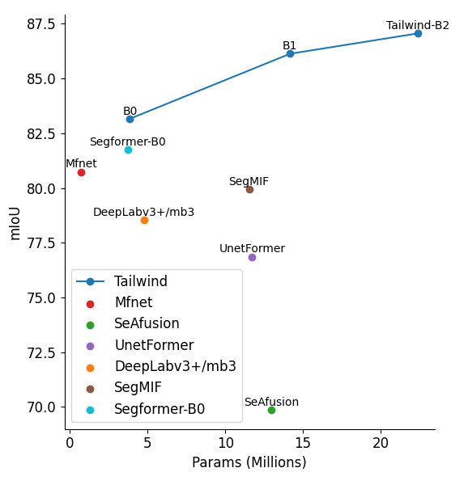

<!--  -->


# TailWindNet

<!--  -->
<div align="center">
  
</div>
<p align="center">
  Figure 1: Performance of Tailwind-B0 to Tailwind-B2 On MPS Dataset.
</p>

### [Project page](https://github.com/Lingwcy/tailwindnet) 

Tailwind：用于加拿大一枝黄花入侵检测的双分支门控跨模态转置注意力骨干网络.<br>


This repository is trimmed to the paper version of [Tailwind](https://arxiv.org/abs/xxxx): the `TailwindV6` backbone and the configs used in the paper.

We use [MMSegmentation v1.1.2](https://github.com/open-mmlab/mmsegmentation/tree/v1.1.2) as the codebase.


## Installation

For install and data preparation, please refer to the guidelines in [MMSegmentation v1.1.2](https://github.com/open-mmlab/mmsegmentation/tree/v1.1.2).

An example (works for me): ```CUDA 12.8``` and  ```torch 2.8.0+cu1281``` 

```
pip install torchvision==0.23.0+cu128
pip install mmcv==2.2.0
pip install -r requirements.txt
pip install -e .
```

Before training or evaluation, update `data_root` in `configs/_base_/datasets/uavm.py` or `configs/_base_/datasets/mfnet.py` to your local dataset path.

## Evaluation

Download `trained weights` and MPS dataset. 
(
[Google Drive[coming soon]](https://drive.google.com/drive/folders/1GAku0) | 
[Quark](https://pan.quark.cn/s/4cdf95e85928) | code：4ifc
)

Example: evaluate ```Tailwind-B0``` on ```MPS```:

```
python tools/test.py configs\taillwindNet\tailwindv6_b0_1xb8-40k_uavm-512x512.py /path/to/checkpoint_file
```

## Training

Example: train ```Tailwind-B0``` on ```MPS```:

```
python tools/train.py configs\taillwindNet\tailwindv6_b0_1xb8-40k_uavm-512x512.py 

```

## Visualize

Here is a demo script to test a single image. More details refer to [MMSegmentation's Doc](https://mmsegmentation.readthedocs.io/en/latest/get_started.html).

```shell
python demo/image_demo.py ${IMAGE_FILE} ${CONFIG_FILE} ${CHECKPOINT_FILE} [--device ${DEVICE_NAME}] [--out-file ${OUT_FILE}]
```

Example: visualize ```Tailwind-B0``` on ```MPS```: 

```shell
python demo/image_demo.py demo/demo.png configs\taillwindNet\tailwindv6_b0_1xb8-40k_uavm-512x512.py \
/path/to/checkpoint_file --device cuda:0 --out-file result.png
```


